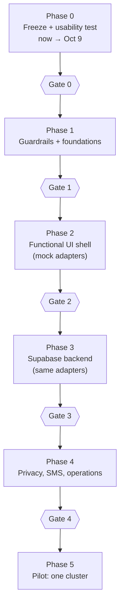

# Roadmap

Six phases. Each ends at a **gate**: a short list of checks that must all be true before the next phase starts. Dates are given only where they are fixed by events; everything else is ordered, not scheduled, because estimates for agent-assisted work on this codebase have no track record yet.

## Phase 0: freeze and learn (now → Oct 9)

**Goal:** protect the Enactus demo and learn where real people get stuck.

- Keep `main` frozen (no merges) until the end of Oct 9 (see correction C4). Production stays at commit `02a6199`.
- Create the rollback point `release/demo-enactus-2026` at `02a6199` (a branch, because tag pushes are dropped by the agent environment's git proxy, see `docs/BLOCKERS.md`).
- Owner checks production in a private window: it must open without a Vercel login.
- Run the Oct 6–7 usability test with the kit in [07-usability-test.md](07-usability-test.md). Log every finding as a GitHub issue with the `ux-finding` label and a severity.
- Work may continue on `develop` (docs, Phase 1 preparation); nothing is promoted to `main`.

**Out of scope:** any production change, any real personal data, any new dependency.

**Gate 0:** the release branch exists; findings are logged with severity; the owner has answered O1 and O2 in [01-decisions.md](01-decisions.md).

## Phase 1: guardrails and foundations

**Goal:** make the wrong thing hard to do before more people and agents write code.

1. **Rules switch.** Replace `AGENTS.md` and `CLAUDE.md` with [AGENTS.next.md](AGENTS.next.md). Record the switch in `docs/DECISIONS.md`.
2. **Required CI** on `develop`, `staging`, `main` (owner action in GitHub settings; see ticket F-01).
3. **Platform upgrade**, as its own PR with nothing else in it: Next.js and React to the current stable releases at the time, with the official codemods. Doing this first means no later code is written against APIs that are about to change.
4. **App structure decision** (O2). If approved, fold the four apps into one app with route groups before the UI kit work starts.
5. **Lint and guard rules** that block the known mistakes (colour literals, raw links, storage outside approved modules, missing labels). See [05-engineering-standards.md](05-engineering-standards.md).
6. **UI kit v1** on Radix primitives: Dialog, AlertDialog, DropdownMenu, Select, Tabs, Toast, Popover, Tooltip, Checkbox, RadioGroup, Switch. Wrapped in `packages/ui` under the owner's guardrails.
7. **Form kit** on React Hook Form + Zod: `Form`, `Field`, `FieldError`, an i18n error map, a submit button that cannot double-submit.
8. **Data kit** on TanStack Query over repository interfaces, with the approved defaults and the state components.
9. **App-level states:** branded `not-found`, `error` and `loading` for every route group; an environment ribbon (Demo / Staging / Production).
10. **End-to-end tests in CI** (Playwright): every route loads with the DemoChip in demo mode and the footer, with no console errors; one critical flow per role.

**Out of scope:** new screens, the backend, real data.

**Gate 1:** required CI is on; the platform upgrade is merged; every kit component has a story or test page and passes keyboard and screen-reader checks; E2E runs on every PR; the colour guard covers hex, `rgb`, `rgba`, `hsl`; no route renders the default Next.js 404.

## Phase 2: functional UI shell for every role

**Goal:** every screen a pilot user will touch works end to end against mock adapters, with every state designed.

- Rebuild each screen on the UI, form and data kits, one screen per PR, highest-traffic first: farmer SMS and slip, driver haul, buyer order, coordinator home, haul, dry, pay, plan, market, farm, then admin.
- Each screen implements the full state matrix in [04-ux-standards.md](04-ux-standards.md#2-state-matrix) and the idiot-proofing rules for its actions.
- Fix every severity 3–4 finding from the usability test; severity 2 findings are scheduled.
- Real route guards behind a mode switch: in product mode, app routes require sign-in for the right role; in demo mode they stay open (so the demo video and screenshots keep working).
- Native review of all Tagalog and Hiligaynon strings that farmers and drivers see.

**Out of scope:** the backend, real data.

**Gate 2:** every screen passes its state matrix in E2E; a second usability round (same scripts) shows no severity 3–4 findings; TL and HIL strings for farmer and driver screens are reviewed by native speakers.

## Phase 3: backend behind the same contracts

**Goal:** swap the mock adapters for Supabase without changing screens.

- Three Supabase projects: development, staging, production. Migrations in the repo; no changes made by hand in the dashboard.
- Tables and row-level security from the draft in [03-architecture.md](03-architecture.md#data-model-draft), reviewed and tested (RLS tests per role).
- `SupabaseAuthAdapter` and Supabase repositories implementing the same interfaces as the mocks. The Zod schemas validate on the server too.
- Audit log for every state change (who, what, when).
- SMS behind an `SmsAdapter` (mock in demo mode, aggregator in product mode).
- Error tracking (if O6 approved) with personal data scrubbed.

**Gate 3:** the full E2E suite passes against the staging Supabase project; RLS tests prove each role sees only its own rows; backups are on and a restore has been rehearsed once.

## Phase 4: privacy, SMS and operations readiness

**Goal:** be allowed and able to hold real people's data. Checklist in [08-pilot-readiness.md](08-pilot-readiness.md).

**Gate 4:** every item in the pilot readiness checklist is ticked and signed off by the owner and the named data protection officer.

## Phase 5: pilot (one cluster)

**Goal:** run one cluster in Dingle with real farmers, buyers and drivers, with the team on call.

- Onboard users in person; the team keeps a paper fallback for every step that the app handles.
- Weekly review of findings, incidents and SMS delivery.
- Exit criteria for the pilot are set with the cluster before it starts (what "worked" means).
