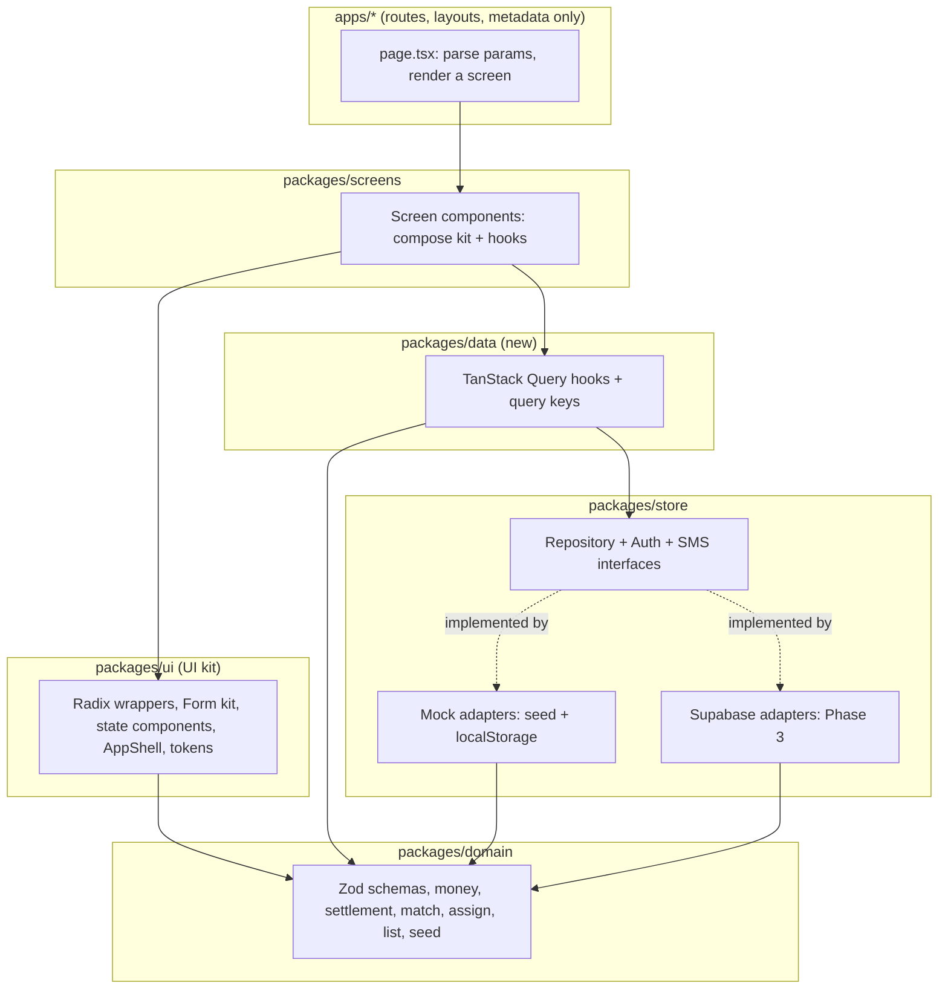

# Target architecture

## Principles

1. **Screens never know where data comes from.** A screen calls a hook (`useHaul(id)`), the hook calls a repository interface, and the repository is either the mock (seed + localStorage) or Supabase. Swapping is a configuration change, not a screen change.
2. **One schema per entity, used everywhere.** A Zod schema defines each entity once; TypeScript types are inferred from it; forms, repositories, the server and tests all import the same schema.
3. **Dependencies point one way.** `apps → screens → ui → domain`, and `screens → data → store → domain`. Lower layers never import higher ones. Lint enforces it (see [05-engineering-standards.md](05-engineering-standards.md#package-boundaries)).
4. **Demo mode is a mode, not a fork.** The same build runs as `demo` (mock adapters, seed data, DemoChip, open routes) or `live` (Supabase, real data, guarded routes).

## Layers



| Package | Owns | Must not |
|---|---|---|
| `apps/*` | Routes, layouts, metadata, headers, redirects. | Contain UI logic beyond parsing params and choosing a screen. |
| `packages/screens` | One component per screen; composition only. | Import Radix, Supabase, `localStorage` or `next/link` directly. |
| `packages/ui` | Design tokens, the UI kit (Radix wrappers), form kit, state components, shells. | Import `screens`, `data`, Supabase. |
| `packages/data` (new) | TanStack Query client, query keys, one hook per use case. | Render UI. |
| `packages/store` | Repository, Auth and SMS interfaces; mock and Supabase implementations; session. | Render UI. |
| `packages/domain` | Zod schemas, pure business logic (money, settlement, matching, assignment, pagination), the seed. | Import React or anything with side effects. |
| `packages/i18n` | Strings (EN/TL/HIL), the Zod error map, formatting helpers. | Contain business logic. |
| `packages/config` | tsconfig, ESLint, Tailwind preset, zones (if kept). | |

## D1: one app or four?

Open question O2. Today there are four Next.js apps on one origin (multi-zones): `main` (public site, coordinator, admin), `buyer`, `driver`, `farmer`.

| | Four apps (today) | One app, route groups (recommended) |
|---|---|---|
| Deploys | Four Vercel projects, four builds per push. | One project, one build. |
| Staging | The main app's staging cannot show the zones' staging builds (M16), so new zone pages cannot be tested end to end. | Every staging page is the staging build. |
| Sessions | Same origin, so cookies work, but each zone boots its own providers. | One provider tree, one session. |
| Navigation | Cross-app links are full page loads; `ZLink` and `zones.mjs` exist to manage it. | Client navigation everywhere; `ZLink` becomes a thin `Link`. |
| Independent release of one role | Possible (not needed at this team size). | Not possible (not needed). |
| Migration cost | None. | Moderate, one-time: move `app/` trees under `(public)`, `(coordinator)`, `(buyer)`, `(driver)`, `(farmer)`, `(admin)` route groups; keep URLs identical. |

Recommendation: one app, done early in Phase 1 before the UI kit work is repeated across four apps. URLs stay the same, so links, bookmarks and the demo video do not change.

## Data contracts

Each entity gets a schema in `packages/domain/src/schemas/`, and the TypeScript type is inferred from it. Example shape (illustrative, field lists are settled in the ticket):

```ts
// packages/domain/src/schemas/haul.ts
export const HaulStatus = z.enum(['requested', 'assigned', 'accepted', 'pickedup', 'delivered', 'cancelled']);
export const Haul = z.object({
  id: z.string().regex(/^H-\d{2,}$/),
  lotId: z.string(),
  sacks: z.number().int().positive().max(1000),
  driverId: z.string().nullable(),
  vehicleId: z.string().nullable(),
  status: HaulStatus,
  pickupDate: z.string().date(),
  updatedAt: z.string().datetime(),
});
export type Haul = z.infer<typeof Haul>;
```

Repository interfaces live in `packages/store` and are async from day one, even though the mock answers immediately, so screens are written for the real latency and failure modes:

```ts
export interface HaulRepo {
  get(id: string): Promise<Haul>;
  list(q: HaulQuery): Promise<Page<Haul>>;
  setStatus(id: string, next: HaulStatus, opts: { idempotencyKey: string }): Promise<Haul>;
}
```

Rules:
- Money is an integer number of centavos everywhere (schema, database `bigint`, API). Formatting to ₱ happens only in the UI.
- Dates are ISO strings in UTC on the wire; the UI shows Asia/Manila time.
- Every write takes an idempotency key so a double tap cannot create two records.
- Errors cross the boundary as typed codes (`not_found`, `forbidden`, `conflict`, `validation`, `network`, `unknown`), never as raw messages. The UI maps codes to i18n keys.

## Data model draft

A **proposal** for Phase 3, written now so the UI states match what the backend will do. Names and columns are reviewed in the Phase 3 ticket before any migration is written.

| Table | Key columns | Notes |
|---|---|---|
| `clusters` | id, name, municipality | One per farmer cluster (pilot: one). |
| `profiles` | id (= auth user), role, display_name, mobile_e164, barangay, cluster_id | Role: coordinator, buyer, driver, farmer, admin. |
| `consents` | id, profile_id, policy_version, channel, accepted_at, withdrawn_at | Proof of consent under RA 10173; never deleted, only withdrawn. |
| `farms` | id, cluster_id, farmer_id, barangay, area_ha, variety | |
| `lots` | id, farm_id, harvest_date, wet_kg, dried_kg, status | |
| `dryer_slots` | id, cluster_id, day, capacity_kg, lot_id, status | |
| `vehicles`, `drivers` | id, kind, capacity_sacks, plate; driver profile_id, vehicle_id, available | |
| `hauls` | id, lot_id, driver_id, vehicle_id, sacks, status, pickup_date | |
| `commitments` | id, buyer_id, tonnes, grade, price_centavos_per_kg, window | |
| `rice_orders` | id, buyer_id, kg, sacks, total_centavos, week, status | |
| `settlements` | id, lot_id, gross_centavos, advance_centavos, balance_centavos, paid_at | The slip is a view of this. |
| `sms_messages` | id, profile_id, direction, body, template, status, provider_id | Bodies never hold more personal data than needed. |
| `audit_log` | id, actor_id, entity, entity_id, action, before, after, at | Append-only. |

### Row-level security (who sees what)

| Role | Reads | Writes |
|---|---|---|
| Farmer | Own profile, own farms, lots, slots, hauls, settlements, SMS. | Own profile (limited), SMS replies, consent. |
| Driver | Own profile; hauls assigned to them. | Status of their own hauls (forward only). |
| Buyer | Own orders and commitments; cluster supply as **aggregates only** (no farmer identities). | Own orders and commitments. |
| Coordinator | Everything in their cluster. | Everything in their cluster except settlements once paid. |
| Admin | Everything. | Configuration; user roles. Every write is audited. |

Every table has RLS on from the first migration; a CI test signs in as each role and checks the table above.

## Environments and modes

| Environment | Branch | Supabase | Mode | Who sees it |
|---|---|---|---|---|
| Local | any | local or dev project | demo or live | Developer. |
| Preview (staging) | `staging` | staging project | live with test accounts, plus demo | Team (Vercel login). |
| Production | `main` | production project | live | Pilot users. |
| Demo | `release/demo-enactus-2026` and the demo mode switch | none | demo | Anyone (Enactus). |

The mode is one environment variable (`NEXT_PUBLIC_RC_MODE=demo|live`). The environment ribbon shows the environment and mode on every page so nobody confuses staging with production or demo data with real data.

## What stays from today

The token pipeline (`design/tokens.json` → `tokens.css`), the i18n package, the domain logic and its tests, the seed (as demo data), the DataAdapter/AuthAdapter pattern (it becomes the repository layer), the branch flow and CI. None of this is thrown away.
