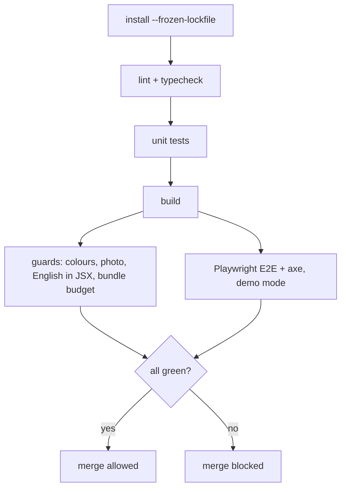

# Engineering standards

The goal is that a rushed developer or an AI agent cannot merge the common mistakes, because a machine stops them. Each rule below names how it is enforced. A rule with no enforcement is a wish; the backlog turns each into a ticket.

## Stack (pinned)

Next.js App Router, React, TypeScript (strict), Tailwind with the token preset, pnpm workspaces, Turborepo, Vitest, Playwright (CI only), Radix UI primitives, React Hook Form, Zod, TanStack Query. Exact versions in `package.json` (no `^` or `~`); the lockfile is committed and CI installs with `--frozen-lockfile`.

Upgrade policy: one dependency family per PR, with its changelog linked in the PR. The Next.js/React upgrade is ticket F-03, the first code change of Phase 1.

## TypeScript

| Rule | Enforcement |
|---|---|
| `strict: true` (already on) | tsconfig |
| Add `noUncheckedIndexedAccess` and `noImplicitOverride` | tsconfig (ticket F-04); fix the errors it reveals in the same PR |
| No `any`; `unknown` + a Zod parse at every boundary (URL params, storage, network) | ESLint `@typescript-eslint/no-explicit-any` |
| Types come from Zod schemas (`z.infer`), not hand-written duplicates | Review checklist + `domain` schema tests |
| No non-null assertions (`!`) outside tests | ESLint `no-non-null-assertion` |

## Package boundaries

Allowed imports (anything else fails lint):

| From | May import |
|---|---|
| `apps/*` | `screens`, `ui`, `i18n`, `config` |
| `packages/screens` | `ui`, `data`, `domain`, `i18n` |
| `packages/data` | `store`, `domain` |
| `packages/ui` | `domain`, `i18n`, `store` (session only) |
| `packages/store` | `domain` |
| `packages/domain` | nothing in the repo; no React |

Enforced with ESLint `import/no-restricted-paths` (or `no-restricted-imports` patterns) in `packages/config/eslint.json` (ticket F-05).

## Lint rules that encode our mistakes

| Mistake seen or likely | Rule |
|---|---|
| Colour literals in class names (20 `rgba(...)` found) | Guard script extended to `#hex`, `rgb(`, `rgba(`, `hsl(`; plus an ESLint `no-restricted-syntax` on string literals in `className` |
| Raw `next/link` or `<a href="/...">` instead of `ZLink` | `no-restricted-imports` for `next/link` outside `packages/ui` |
| `localStorage` outside approved modules | `no-restricted-globals` / `no-restricted-properties`, allowed only in `store`, `i18n`, theme |
| `window.confirm` / `alert` / `prompt` | `no-restricted-globals` |
| Missing labels, bad ARIA | `eslint-plugin-jsx-a11y` strict (ships with `next/core-web-vitals` as recommended; switch to strict) |
| Hand-rolled dialogs and menus | `no-restricted-syntax` on `<dialog>` and `role="listbox"` outside `packages/ui` |
| Hardcoded English in JSX | Custom rule or a CI script that flags JSX text nodes with letters outside `packages/i18n` (allow-list for the brand name and team footer) |
| `console.log` left in code | `no-console` (warn locally, error in CI) |

## Formatting

Prettier (if O3 approved) with one shared config, checked in CI with `prettier --check`. Until then, follow the existing style: 4-space indent in packages, 2 in apps.

## Testing

| Layer | Tool | What it covers | Where it runs |
|---|---|---|---|
| Domain and schemas | Vitest | Money, settlement, matching, assignment, pagination, every Zod schema (valid and invalid samples), the i18n error map has every key. | Local + CI |
| Store and data | Vitest | Mock repositories honour the interfaces; idempotency; session; query keys. | Local + CI |
| UI kit | Vitest + Testing Library (if O4 approved) | Each wrapper: renders, keyboard, focus return, reduced motion. | Local + CI |
| Screens and flows | Playwright | Every route: 200, DemoChip (demo mode), footer, no console errors, no horizontal scroll at 360px. One critical flow per role (below). | CI only |
| Accessibility | `@axe-core/playwright` (if O5 approved) | No serious or critical violations on every route. | CI only |
| Visual | Playwright `toHaveScreenshot` | Key screens at 390 and 1440, light and dark. | CI only, updated by label |
| RLS (Phase 3) | Vitest against the staging Supabase | Each role sees exactly its rows. | CI on `staging` |

Critical flows (E2E, one spec each):
1. Farmer: open SMS, reply `1`, see the slot confirmed; open the slip.
2. Driver: sign in, accept the haul, mark picked up, mark delivered; the coordinator sees Delivered.
3. Buyer: sign in, place an order (stepper, summary, confirm), see it in My Orders; the coordinator home shows it.
4. Coordinator: sign in, filter farms (URL keeps the state), reassign a haul, undo it.
5. Auth: empty submit shows errors and focuses the first field; valid sign-up lands on the home page; sign out returns to sign-in.

Rule: a bug fix comes with a test that fails before the fix.

## CI pipeline

- Runs on every PR into `develop`, `staging`, `main` and on pushes to `develop` (as today).
- Required status checks: `check` (lint, types, unit, build, guards) and `e2e`. No reviewer required (owner decision P3).
- Playwright installs its browser inside CI only; agent sessions never run it (owner decision P8).
- Bundle budget: a script reads `next build` output and fails if any route's first-load JS grows more than 10% over the recorded baseline.

## Branches, commits, releases

- Long-lived: `main` (production), `staging` (preview), `develop` (integration). Feature branches from `develop`, named `feat/…`, `fix/…`, `chore/…`, `docs/…`.
- Promotion by PR only: `develop → staging → main`. Required CI on all three (owner action, ticket F-01).
- Commit messages: Conventional Commits (`feat(buyer): order summary step`). The PR title follows the same form.
- One ticket per PR. A PR over about 400 changed lines (excluding lockfiles and generated files) is split unless the ticket says otherwise.
- Releases: when `staging` is promoted to `main`, the PR lists the tickets included; a GitHub release is created by the owner (tags cannot be pushed from the agent environment).
- Rollback: Vercel Instant Rollback for deploys; a revert PR for code (see `docs/CUTOVER.md`).

## Dependencies

- Allow-list in `AGENTS.md`; anything else needs the owner's approval, recorded in `docs/DECISIONS.md`.
- Dependabot (built into GitHub, no new package) opens grouped weekly PRs for security updates only.
- `pnpm audit --prod` runs in CI and fails on high or critical advisories.

## Security baseline

- Secrets live only in Vercel and Supabase settings, never in the repo. Only values that are safe to publish may use the `NEXT_PUBLIC_` prefix. The Supabase service-role key is server-only.
- Row-level security on every table from the first migration (Phase 3); a CI test per role.
- Validate every input on the server with the same Zod schema as the client.
- Security headers: Content-Security-Policy, `X-Frame-Options`/`frame-ancestors`, `Referrer-Policy`, `Permissions-Policy`, set in one shared helper.
- Rate limits on sign-in, sign-up and SMS sending (Supabase auth limits plus a server check).
- Personal data never appears in logs, error reports, analytics or URLs.

## Observability (from Phase 3)

- Error tracking (O6) with personal data scrubbed and the release (commit) attached.
- Structured server logs with a request ID shown to users on error screens as the reference code.
- An uptime check on the production URL and on the SMS webhook.

## Documentation

- `docs/DECISIONS.md` for every decision (as today); `docs/BLOCKERS.md` for blockers.
- Each package has a short README: purpose, public API, what it must not do.
- Architecture changes get a decision record (problem, options, choice, consequences) in `docs/DECISIONS.md`.
