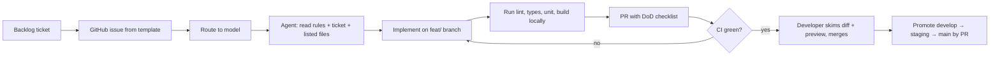

# Agent playbook

How a task goes from the backlog to a merged PR when an AI agent writes most of the code. The aim is that any agent, on any model, produces the same shape of work, and that the checks catch it when it does not.

## The loop



## Ticket template (copy into the GitHub issue)

```markdown
### Goal
One sentence: what the user can do after this ticket.

### Context
- Plan: docs/plan/<file>.md#<section>
- Related decisions: M-xx
- Screens/routes: /buyer/orders

### Scope (files the agent may change)
- packages/screens/src/buyer-orders.tsx
- packages/ui/src/Components/...

### Out of scope
- Anything not listed above. No new dependencies. No token changes.

### Acceptance criteria
- [ ] ...
- [ ] All applicable states from 04-ux-standards.md#state-matrix
- [ ] i18n keys added in EN/TL/HIL (TL/HIL marked draft)

### Test plan
- Unit: ...
- E2E: ...

### Model
<from the routing table>
```

## Model routing (owner's default)

| Task type | Model | Why |
|---|---|---|
| Scaffolding: new package, route group, file moves, boilerplate | DeepSeek V4 Pro | Fast at mechanical structure. |
| Complex: data layer, adapters, Supabase, RLS, migrations, multi-file refactors | Kimi 3 | Holds large context across files. |
| Design: UI kit components, screen layouts, state designs, copy | Claude Sonnet | Strong at UI detail and accessibility. |
| Reasoning: business rules (settlement, matching, assignment), test design, decision records | GLM 2.5 | Careful step-by-step logic. |
| All-round tasks and quick edits: copy fixes, small bugs, docs | MIMO v2.5 Pro | Cheap and quick. |
| Frontend minimal: one-component tweaks, styling fixes | Flash 3.6 (Antigravity) | Fast for small UI changes. |

When a ticket mixes types, split it. If a model fails CI twice on the same ticket, move it up one tier (to Kimi 3 or Claude Sonnet) rather than retrying.

## What every agent must do

1. Read `AGENTS.md`, `docs/plan/README.md`, the ticket, and every file in the ticket's scope before writing.
2. Stay inside the ticket's scope. If something outside it is broken, note it in the PR description instead of fixing it.
3. Use the kits: UI kit for controls, form kit for forms, data hooks for data, `ZLink` for links. Never hand-roll a dialog, menu, form or fetch.
4. Add strings in EN, TL and HIL (TL/HIL marked draft); never hardcode English in JSX.
5. Run `pnpm lint && pnpm build && pnpm test` before opening the PR, and paste the summary lines into the PR.
6. Record any decision or rule conflict in `docs/DECISIONS.md` in the same PR.
7. Say in the PR what was not verified (for example, "not checked on a real phone").

## What an agent must never do

- Add, remove or upgrade a dependency unless the ticket is that upgrade.
- Edit design tokens (`design/tokens.json`, `tokens.css`) or write colour literals.
- Disable, skip or weaken a test or a lint rule to get green.
- Push to `staging` or `main`, force-push, or rewrite history.
- Put real personal data (names, numbers, locations of real people) in code, fixtures, tests or screenshots.
- Use `window.confirm`, `alert` or `prompt`.
- Change behaviour that the ticket did not ask for, including "small improvements".

## Definition of done

- [ ] Acceptance criteria all ticked, each with how it was checked.
- [ ] CI green (lint, types, unit, build, guards, E2E).
- [ ] New or changed behaviour has a test (bug fixes: a test that failed before).
- [ ] State matrix covered for every screen touched.
- [ ] Strings in EN/TL/HIL; no hardcoded English.
- [ ] No new dependencies; no colour literals; package boundaries respected.
- [ ] `docs/DECISIONS.md` updated if a decision was made.
- [ ] PR description lists what was not verified.

## Review without reviewers

There is no required human reviewer (owner decision P3), so the developer who merges does a two-minute check:
1. Read the PR's "not verified" list.
2. Open the Vercel or local preview of the changed screen at 390px and 1440px.
3. Skim the diff for files outside the ticket scope.

Optional: run an AI code review on the PR as a non-blocking check; treat its high-severity findings as blocking.

## Prompt starter for a ticket

```text
You are working in the RiceConnect monorepo. Read AGENTS.md and docs/plan/README.md first.
Ticket: <paste the issue>.
Rules: stay inside the listed files; use the UI kit, form kit and data hooks; strings in EN/TL/HIL;
no new dependencies; no colour literals; run pnpm lint && pnpm build && pnpm test and paste the result.
Open a PR into develop with the definition-of-done checklist ticked and a "Not verified" section.
```
