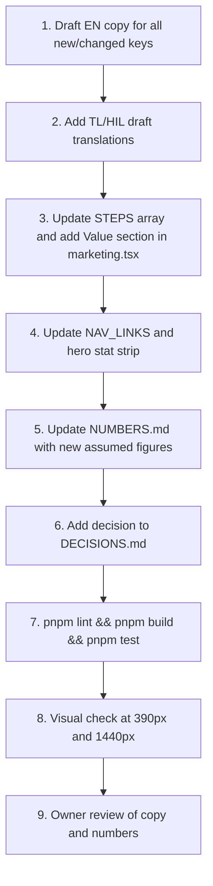

# Marketing Page Pitch-Alignment Plan

> **Goal:** Retune the public landing page so a judge, partner, or municipal official who reads it for 90 seconds walks away understanding:  
> _"This is operational coordination infrastructure that gives smallholders industrial-scale bargaining power without taking their land."_

> **Files touched:**
>
> - [marketing.tsx](file:///s:/Dev/Enactus/rice-connect/packages/screens/src/marketing.tsx) — layout & components
> - [strings.prototype.ts](file:///s:/Dev/Enactus/rice-connect/packages/i18n/src/strings.prototype.ts) — EN / TL / HIL copy
> - [overrides.json](file:///s:/Dev/Enactus/rice-connect/packages/domain/src/overrides.json) — if any new assumed figures are needed
> - [NUMBERS.md](file:///s:/Dev/Enactus/rice-connect/docs/NUMBERS.md) — document any new assumed numbers
> - [DECISIONS.md](file:///s:/Dev/Enactus/rice-connect/docs/DECISIONS.md) — record the marketing copy pivot decision

---

## Summary of Current vs. Target State

| Area              | Current                                               | Target                                                                                         |
| ----------------- | ----------------------------------------------------- | ---------------------------------------------------------------------------------------------- |
| Hero headline     | _"Rice farmers sell together, on their own terms."_   | Lead with the institutional thesis: _farm consolidation without land consolidation_            |
| Hero sub          | Generic coordinator + SMS pitch                       | Declare RiceConnect is **operational coordination infrastructure**, not a marketplace          |
| Value proposition | One flat list of 4 system roles                       | Two distinct audience funnels: **Buyers/Millers** and **Farmer Clusters**                      |
| How It Works flow | Supply-push: Calendar → Commitment → Dry → Haul → Pay | Demand-pull: Institutional Demand → Cluster Plan → Bulk Inputs → Harvest & Dry → Settlement    |
| Human-in-the-loop | Coordinator described generically                     | Name the human: **Cluster Leads** (youth agri-interns, coop officers)                          |
| Grounded reality  | Dingle, Iloilo + ISUFST + KWADRA TBI present          | Add **target impact metrics**: +15–20% net income, <5% post-harvest loss, 10–14% input savings |
| CTAs              | "Open Prototype" / "Try It" / "See It"                | Role-specific: "Partner for Sourcing" / "Register a Cluster" / "Open Prototype"                |
| Footer tagline    | _"Cluster selling for smallholder rice farmers."_     | _"Farm consolidation without land consolidation."_ or similar thesis echo                      |

---

## Phase 1 — Copy Rewrites (strings.prototype.ts)

All copy changes live in [strings.prototype.ts](file:///s:/Dev/Enactus/rice-connect/packages/i18n/src/strings.prototype.ts). Every new or changed key needs EN, TL, and HIL values (TL/HIL marked `draft: needs native review` until signed off).

### 1A. Hero Section (Check 1)

| Key              | Current EN                                                  | Proposed EN                                                                                                                                                                                                                                                                                                                                                     |
| ---------------- | ----------------------------------------------------------- | --------------------------------------------------------------------------------------------------------------------------------------------------------------------------------------------------------------------------------------------------------------------------------------------------------------------------------------------------------------- |
| `mk.hero.title`  | _"Rice farmers sell [[together]], on their [[own terms]]."_ | _"[[Farm consolidation]] without [[land consolidation]]."_                                                                                                                                                                                                                                                                                                      |
| `mk.hero.sub`    | _"RiceConnect helps a coordinator run a cluster…"_          | _"RiceConnect is operational coordination infrastructure for smallholder rice farming. It organizes a cluster of independent farms into one supply unit — planned harvests, pre-committed buyers, shared drying and hauling — so farmers sell at industrial scale without giving up a single hectare. Cluster Leads run the dashboard. Farmers only need SMS."_ |
| `mk.footer.line` | _"Cluster selling for smallholder rice farmers."_           | _"We don't consolidate land. We consolidate opportunity. A prototype by Team Syntaxure Labs."_                                                                                                                                                                                                                                                                  |

> [!IMPORTANT]  
> The hero headline is the single most critical piece of copy. The phrase _"farm consolidation without land consolidation"_ must appear **above the fold**, verbatim, in a size that a phone screen renders without scrolling.

**Rationale:** The current headline ("sell together, on their own terms") is warm but vague — it could describe any cooperative. The thesis statement is the differentiator that separates RiceConnect from every other agri-marketplace pitch a judge has seen.

### 1B. Dual-Sided Value Proposition (Check 2)

**New section: `#value`** — inserted between `#problem` and `#how` in the page order.

New i18n keys:

| Key                   | EN (proposed)                                                                                                                                                                                         |
| --------------------- | ----------------------------------------------------------------------------------------------------------------------------------------------------------------------------------------------------- |
| `mk.nav.value`        | _"Who Benefits"_                                                                                                                                                                                      |
| `mk.value.eyebrow`    | _"Two Sides, One Supply Chain"_                                                                                                                                                                       |
| `mk.value.title`      | _"For [[Buyers]] who need predictability. For [[Farmers]] who need autonomy."_                                                                                                                        |
| `mk.value.buyer.h`    | _"Institutional Buyers & Millers"_                                                                                                                                                                    |
| `mk.value.buyer.p`    | _"Aggregated volume from dozens of farms. Standardized moisture grading (14% MC). Committed supply windows you can plan inventory around. One invoice, not fifty."_                                   |
| `mk.value.buyer.cta`  | _"Partner for Sourcing"_                                                                                                                                                                              |
| `mk.value.farmer.h`   | _"Farmer Clusters"_                                                                                                                                                                                   |
| `mk.value.farmer.p`   | _"Keep your land. Cut input costs 10–14% through bulk purchasing. Bypass predatory trader debt (pautang). Dry on schedule instead of losing 15–30% to weather. Get 80% of your pay within 24 hours."_ |
| `mk.value.farmer.cta` | _"Register a Cluster"_                                                                                                                                                                                |

> [!NOTE]  
> The numbers 10–14% input savings, 15–30% drying losses, and 80% advance within 24h are either from the brief (`PRICE.advancePct = 80`) or must be added to [NUMBERS.md](file:///s:/Dev/Enactus/rice-connect/docs/NUMBERS.md) as **assumed** with sources. The existing `3% loss` param in [params.ts](file:///s:/Dev/Enactus/rice-connect/packages/domain/src/params.ts#L15) is the **cluster's** post-harvest loss target; the 15–30% figure is the **baseline without the cluster** (Philippine Rice Research Institute data). Both figures need documentation.

### 1C. "How It Works" — Demand-First Reorder (Check 3)

**Current step order and keys:**

```
1. Calendar    (mk.step.plan)    → /plan
2. Commitment  (mk.step.commit)  → /market
3. Dry         (mk.step.dry)     → /dry
4. Haul        (mk.step.haul)    → /haul
5. Pay         (mk.step.pay)     → /pay/L-03
```

**Proposed step order:**

```
1. Demand       (mk.step.demand)  → /market     [NEW key]
2. Cluster Plan (mk.step.plan)    → /plan       [REWRITE copy]
3. Bulk Inputs  (mk.step.inputs)  → (no link)   [NEW key, NEW step]
4. Harvest & Dry(mk.step.harvest) → /dry        [NEW key, merges harvest+dry]
5. Settlement   (mk.step.settle)  → /pay/L-03   [NEW key]
```

New / rewritten i18n keys:

| Key                 | EN (proposed)                                                                                                                                                                                   |
| ------------------- | ----------------------------------------------------------------------------------------------------------------------------------------------------------------------------------------------- |
| `mk.how.title`      | _"Demand, Plan, Inputs, Harvest, [[Settlement]]"_                                                                                                                                               |
| `mk.step.demand.h`  | _"Buyer Demand"_                                                                                                                                                                                |
| `mk.step.demand.p`  | _"Millers, retailers and restaurants commit volume, grade, moisture spec and price before a single stalk is cut. Demand drives the entire chain."_                                              |
| `mk.step.plan.h`    | _"Cluster Production Plan"_                                                                                                                                                                     |
| `mk.step.plan.p`    | _"The Cluster Lead maps every farm's harvest week by barangay and matches production windows to buyer commitments. Farmers are notified by SMS."_                                               |
| `mk.step.inputs.h`  | _"Bulk Inputs"_                                                                                                                                                                                 |
| `mk.step.inputs.p`  | _"The cluster pools purchasing power: seeds, fertilizer and crop protection bought together at 10–14% below individual retail. No one takes a loan from a trader."_                             |
| `mk.step.harvest.h` | _"Synchronized Harvest & Drying"_                                                                                                                                                               |
| `mk.step.harvest.p` | _"Each lot gets a dryer slot on its harvest day. Palay is dried to 14% moisture within hours, not days — cutting post-harvest losses below 5%."_                                                |
| `mk.step.settle.h`  | _"Fast Settlement"_                                                                                                                                                                             |
| `mk.step.settle.p`  | _"Quoted price minus drying minus coordination margin equals net to the farmer. 80% advance within 24 hours. Balance when the buyer pays. A printed slip in the farmer's hand, not a promise."_ |

**Layout change in `marketing.tsx`:**

Update the `STEPS` array (line ~456):

```tsx
const STEPS = [
  { icon: 'Market', k: 'demand', href: '/market' },
  { icon: 'Plan', k: 'plan', href: '/plan' },
  { icon: 'Package', k: 'inputs', href: null }, // no prototype link yet
  { icon: 'Dry', k: 'harvest', href: '/dry' },
  { icon: 'Pay', k: 'settle', href: '/pay/L-03' }
];
```

> [!WARNING]  
> The "Bulk Inputs" step (`mk.step.inputs`) has **no corresponding prototype screen**. The `href` must be `null` and the "See It" link must be conditionally hidden or replaced with a "Coming Soon" chip. This must be clearly labeled `[Model]` with a `ClaimTag`.

### 1D. Human-in-the-Loop — Cluster Leads (Check 4)

Rewrite the Coordinator role card to foreground the human identity:

| Key                     | Current EN                                                            | Proposed EN                                                                                                                                                                                                                    |
| ----------------------- | --------------------------------------------------------------------- | ------------------------------------------------------------------------------------------------------------------------------------------------------------------------------------------------------------------------------ |
| `mk.role.coordinator.h` | _"Coordinator"_                                                       | _"Cluster Lead"_                                                                                                                                                                                                               |
| `mk.role.coordinator.p` | _"Runs the cluster: farms, plan, buyers, dryer, hauls and payments."_ | _"A youth agri-intern, coop officer or lead farmer who operates the dashboard. They register farms, match lots to buyers, dispatch hauls and settle payments — the human bridge between the system and the SMS-only farmers."_ |
| `mk.who.title`          | _"Four People, [[One Lot]]"_                                          | _"A Cluster Lead, Three Partners, [[One Lot]]"_                                                                                                                                                                                |

Also update the hero subheadline (already covered in 1A above) to say "Cluster Leads run the dashboard" instead of "a coordinator."

### 1E. Impact Metrics — Grounded Reality (Check 5)

**New section or enhancement to existing `#status` section.** Two options:

**Option A (recommended): Add a "Target Impact" sub-block inside the existing hero stat strip** (the `band-inset` section at line ~526 that currently shows farm count, area and location). Add two new stat cells:

| Key                  | EN (proposed)                 |
| -------------------- | ----------------------------- |
| `mk.hero.income`     | _"Target: Net Income"_        |
| `mk.hero.income.val` | _"+15–20%"_                   |
| `mk.hero.loss`       | _"Target: Post-Harvest Loss"_ |
| `mk.hero.loss.val`   | _"<5%"_                       |

Both tagged `[Assumed]` with a `ClaimTag`.

**Option B: Dedicated "Impact" section** between `#status` and `#team`. This is heavier and may dilute the page flow.

> [!IMPORTANT]  
> Every number shown must be documented in [NUMBERS.md](file:///s:/Dev/Enactus/rice-connect/docs/NUMBERS.md) with its source and the `assumed` label. The +15–20% net income figure needs a brief justification (e.g., "Based on elimination of trader markup (pautang interest), 10–14% bulk input savings, and reduced drying losses from ~15% baseline to <5%").

---

## Phase 2 — Layout Changes (marketing.tsx)

### 2A. Section Order

Current page order:

```
Hero → ↓ Scroll → Problem → How It Works → Who It's For → Four Domains → Status → Team → FAQ
```

Proposed page order:

```
Hero → ↓ Scroll → Problem → Value Proposition [NEW] → How It Works [REORDERED] → Who It's For [REWRITTEN] → Four Domains → Impact & Status [ENHANCED] → Team → FAQ
```

### 2B. Navigation Updates

Update `NAV_LINKS` (line ~107) to include the new `#value` section:

```tsx
const NAV_LINKS = [
  ['#problem', 'mk.nav.problem'],
  ['#value', 'mk.nav.value'], // NEW
  ['#how', 'mk.nav.how'],
  ['#who', 'mk.nav.who'],
  ['#domains', 'mk.domains.eyebrow'],
  ['#status', 'mk.nav.status'],
  ['#faq', 'mk.nav.faq']
] as const;
```

### 2C. New "Value Proposition" Component

A new `Section` with `id="value"` containing two side-by-side cards (responsive: stacked on mobile, two columns on `md+`).

```
┌─────────────────────────┐  ┌─────────────────────────┐
│  🏭 Institutional       │  │  🌾 Farmer Clusters     │
│  Buyers & Millers       │  │                         │
│                         │  │                         │
│  • Aggregated volume    │  │  • Keep your land       │
│  • 14% MC standardized  │  │  • 10-14% input savings │
│  • Committed windows    │  │  • Bypass pautang       │
│  • One invoice          │  │  • <5% drying losses    │
│                         │  │  • 80% pay in 24h       │
│  [Partner for Sourcing] │  │  [Register a Cluster]   │
└─────────────────────────┘  └─────────────────────────┘
```

Each card uses the existing `cardCls` (`panel-solid rounded-2xl`) styling. CTAs are the same outlined-accent pill buttons used elsewhere on the page. Since this is a prototype with no real forms, both CTAs link to `mailto:${CONTACT_EMAIL}` for now, with a tooltip or note: _"Interested? Email the team."_

### 2D. "How It Works" Step Modifications

1. **Reorder the `STEPS` array** to demand-first sequence (see 1C above).
2. **Add conditional rendering** for steps without a prototype link (`href: null`): hide the "See It" button and show a `ClaimTag tag="model"` chip instead.
3. **Add an `Inputs` icon** — verify if the icon set already has `Package`, `ShoppingBag`, or `Seedling`. If not, use `Box` or similar from the existing Lucide set.

### 2E. Hero Stat Strip Enhancement

Add two new cells to the `band-inset` grid (line ~526):

```tsx
<div>
    <div className="...eyebrow...">{t('mk.hero.income')}</div>
    <div className="...big-number...">{t('mk.hero.income.val')}</div>
    <ClaimTag tag="assumed" />
</div>
<div>
    <div className="...eyebrow...">{t('mk.hero.loss')}</div>
    <div className="...big-number...">{t('mk.hero.loss.val')}</div>
    <ClaimTag tag="assumed" />
</div>
```

### 2F. CTA Updates

| Location                          | Current                      | Proposed                                                            |
| --------------------------------- | ---------------------------- | ------------------------------------------------------------------- |
| Header nav button                 | "Open Prototype"             | Keep as-is (this is for evaluators exploring the demo)              |
| Hero primary CTA                  | "Open Prototype" → `/launch` | Keep as-is                                                          |
| Hero secondary CTA                | "How It Works" → `#how`      | Keep as-is                                                          |
| **NEW:** Value section buyer CTA  | —                            | "Partner for Sourcing" → `mailto:${CONTACT_EMAIL}?subject=Sourcing` |
| **NEW:** Value section farmer CTA | —                            | "Register a Cluster" → `mailto:${CONTACT_EMAIL}?subject=Cluster`    |
| Role card CTAs                    | "Try It" → sign-in pages     | Keep as-is                                                          |
| Footer contact link               | "Email the Team"             | Keep as-is                                                          |

---

## Phase 3 — Documentation & Compliance

### 3A. NUMBERS.md Updates

Add the following rows to the Assumptions table in [NUMBERS.md](file:///s:/Dev/Enactus/rice-connect/docs/NUMBERS.md):

| Value                                               | Where                                    | Why                                                                                                                                                                            |
| --------------------------------------------------- | ---------------------------------------- | ------------------------------------------------------------------------------------------------------------------------------------------------------------------------------ |
| Baseline post-harvest loss 15–30% (without cluster) | `mk.value.farmer.p`, `mk.step.harvest.p` | **assumed** from PhilRice / IRRI published figures for sun-drying smallholders. Cite: _"Post-harvest losses in the Philippines range from 15% to as high as 37%."_ — PhilRice. |
| Target post-harvest loss <5% (with cluster)         | `mk.hero.loss.val`                       | **assumed** target for mechanical drying within 24h of harvest.                                                                                                                |
| Bulk input savings 10–14%                           | `mk.value.farmer.p`, `mk.step.inputs.p`  | **assumed** from cooperative bulk-purchasing benchmarks. Needs validation with actual Dingle supplier quotes in Phase 5.                                                       |
| Target net income improvement +15–20%               | `mk.hero.income.val`                     | **assumed** aggregate of: elimination of pautang markup, input savings, and reduced losses. Not validated until pilot.                                                         |
| Baseline pautang (trader debt cycle) interest       | `mk.value.farmer.p`                      | **assumed** reference to the palay-buying practice where traders advance cash at planting and buy the harvest at below-market price. No specific interest rate figure shown.   |

### 3B. DECISIONS.md Entry

```markdown
| Mxx | Marketing copy pivot for Enactus pitch alignment | The public marketing page copy was rewritten to lead with the thesis "farm consolidation without land consolidation" instead of the generic "sell together." Five changes: (1) hero reframed as operational coordination infrastructure, (2) new dual-sided value proposition section for buyers and farmers with distinct CTAs, (3) "How It Works" reordered to demand-first flow with a new Bulk Inputs step, (4) Coordinator renamed to Cluster Lead with the human identity foregrounded, (5) target impact metrics (+15–20% income, <5% loss) added to the hero strip as assumed. All new numbers documented in NUMBERS.md. TL/HIL drafts need native review. |
```

### 3C. Claim Tags

Every new number on screen must carry a `ClaimTag`:

| Number                      | Tag                                                       |
| --------------------------- | --------------------------------------------------------- |
| +15–20% net income          | `assumed`                                                 |
| <5% post-harvest loss       | `assumed`                                                 |
| 10–14% input savings        | `assumed`                                                 |
| 80% advance within 24h      | `model` (already in the brief as `PRICE.advancePct = 80`) |
| 14% MC standardized grading | `model` (from `forecastMcPct` in overrides)               |

---

## Phase 4 — Verification Checklist

### Visual Verification (owner or agent browser session)

- [ ] At 390px (phone), the thesis headline renders **above the fold** without truncation
- [ ] At 1440px (desktop), the dual-value cards sit side by side without overflow
- [ ] The new "Bulk Inputs" step has no dead "See It" link — either hidden or replaced with `[Model]`
- [ ] Impact metrics in the hero strip have visible `[Assumed]` chips
- [ ] All new sections appear in the nav menu (both inline and hamburger)
- [ ] The `ClaimTag` colour on the band-inset (dark background) is legible
- [ ] Footer tagline updated

### i18n Verification

- [ ] Every new key has EN, TL, HIL values
- [ ] TL and HIL values are tagged as drafts pending native review
- [ ] No string concatenation for sentences (interpolation via `{var}` only)
- [ ] `pnpm build` passes with no missing key warnings

### CI / Lint Verification

- [ ] No colour literals added (the guard catches hex/rgb/rgba/hsl)
- [ ] No banned patterns: `rice-field`, `rc-photo`, `photo-scrim`
- [ ] No new dependencies added
- [ ] `pnpm lint && pnpm build && pnpm test` passes

### Content Accuracy

- [ ] Every assumed number is in [NUMBERS.md](file:///s:/Dev/Enactus/rice-connect/docs/NUMBERS.md) with the `assumed` label
- [ ] No real person's data in any string
- [ ] The DemoChip still appears in demo mode
- [ ] The footer still shows "Team Syntaxure Labs · ISUFST"

---

## Execution Order



**Estimated effort:** M (about a day of agent work). The changes are copy-heavy but structurally contained — no new packages, no new routes, no backend changes.

---

## Open Questions for Owner

1. **"Farm consolidation without land consolidation"** — Is this the exact thesis phrasing you want in the headline, or do you prefer a variation like _"We don't consolidate land. We consolidate opportunity."_?

2. **Bulk Inputs step** — The prototype has no Bulk Inputs screen. Should the "How It Works" step link to nothing (with a `[Model]` tag), or should we build a placeholder explainer card?

3. **Impact metric sources** — The +15–20% net income and <5% post-harvest loss figures: do you have specific PhilRice / IRRI citations, or should we label these as team projections?

4. **CTA destinations** — "Partner for Sourcing" and "Register a Cluster" currently have no intake form. Should they `mailto:` the team email, or should we build a simple contact/interest form?

5. **"Cluster Lead" rename** — Should this rename also propagate into the prototype UI (the coordinator app's own navigation), or only on the marketing page?
